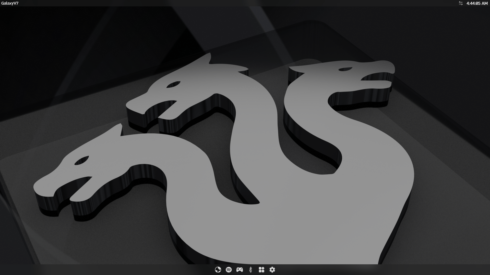
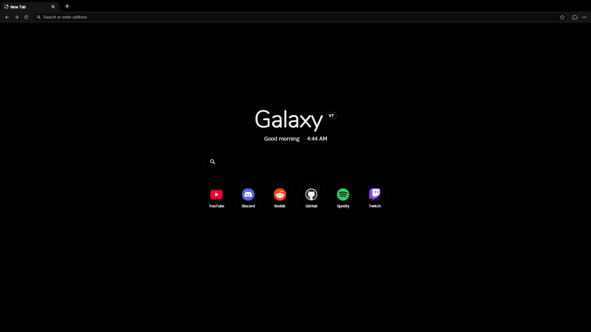
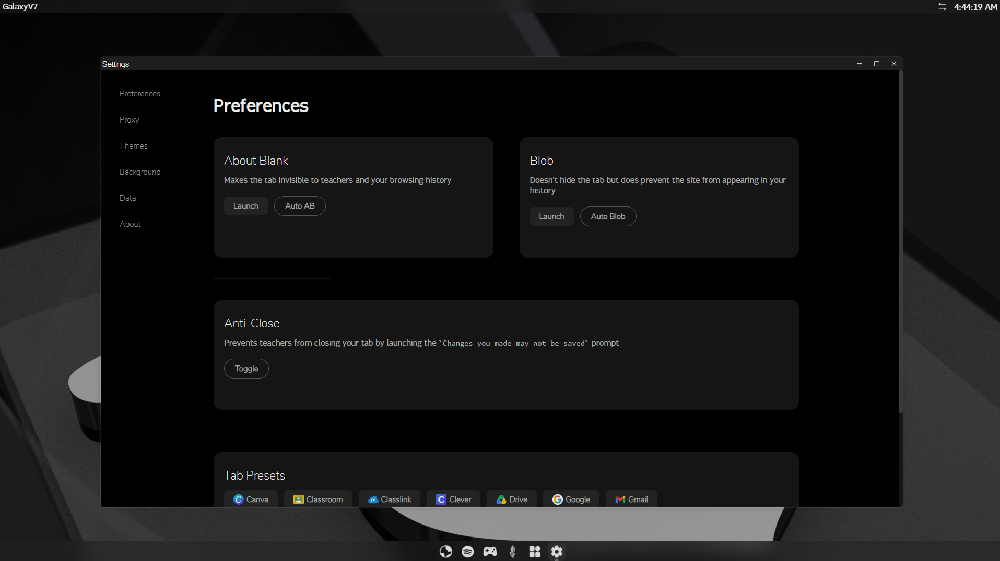

# Velora

> A minimal browser with vertical tabs and a floating address palette.

Velora is based on [GalaxyV777](https://github.com/IlIllIllIIIIIIII/GalaxyV777). Existing proxy engines, saved-data identifiers, and backup compatibility are retained.

**Demo:** https://galxy.it.com/

## Run Velora Locally

### Prerequisites

- [Bun](https://bun.com/docs/installation)
- [Node.js](https://nodejs.org/en/download)

### Install Velora

```bash
git clone https://github.com/r480github/GalaxyV7
cd GalaxyV7
bun i
```

### Install Games (Optional)

```bash
cd static
git clone https://gitlab.com/Hydra.Network/game-assets/endis-assets books
cd ..
```

### Dev

```bash
bun run dev
```

Default port: `5173`

### Prod

```bash
bun run build
bun index.js
```

Default port: `5417`

## Google Cloud Run

Use Google Cloud Shell or an authenticated Google Cloud CLI with a billing-enabled
project and permission to build and deploy Cloud Run services. Run these commands
from the repository root, replacing `YOUR_PROJECT_ID`:

```bash
gcloud services enable run.googleapis.com cloudbuild.googleapis.com artifactregistry.googleapis.com --project YOUR_PROJECT_ID
gcloud run deploy galaxyv777 \
  --project YOUR_PROJECT_ID \
  --region us-central1 \
  --source . \
  --port 8080 \
  --memory 1Gi \
  --cpu 1 \
  --concurrency 80 \
  --max-instances 3 \
  --timeout 3600 \
  --no-use-http2 \
  --allow-unauthenticated
```

This creates a public service. Source deployment uses the included Dockerfile,
which builds SvelteKit with Bun and preserves the locked libcurl patch. It starts
`index.js` so the `/lively/` WebSocket proxy and transport assets are available.
The server listens on `0.0.0.0:$PORT`; `/healthz` provides a health check.
The container uses Cloud Run's `X-Forwarded-Proto` header for HTTPS URL detection.
You can instead set `ORIGIN` to your exact public URL if using a custom domain.

Open the service URL printed by the deployment command. Test `/healthz`, then
open a page in Velora's browser to verify the proxy connection.

Cloud Run WebSockets have a maximum lifetime of 60 minutes, even while active;
reload the Velora browser tab if a long session disconnects. Open connections keep
an instance active and incur usage charges. HTTP/2 end-to-end must stay disabled.
See [Google's WebSocket guidance](https://cloud.google.com/run/docs/triggering/websockets).

Optional games must be downloaded into `static/books` **before** deployment so
they are included in the build. Runtime filesystem changes are not persistent.

To test the container locally with Docker:

```bash
docker build --platform linux/amd64 -t galaxyv777 .
docker run --rm -p 8080:8080 -e PORT=8080 galaxyv777
```

## Don't have a server?

The original project can also be deployed statically with Netlify or other static deployers.
[GalaxyV7-Static](https://github.com/r480github/GalaxyV7-Static)

## A Look Inside

### OS



### Browser



### Settings


